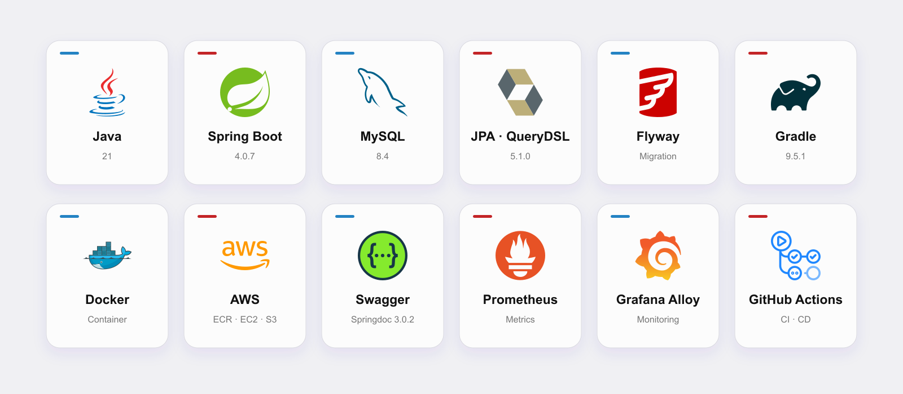
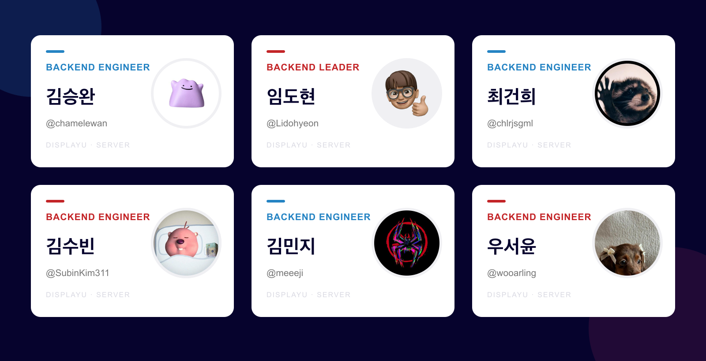

# DISPLAYU BACKEND

대학생의 전시 경험을 하나로 연결하는 플랫폼 
**DisplayU의 백엔드 서버입니다.**

[서비스 바로가기](https://www.displayu.co.kr) · [Wiki](https://github.com/UMC-DISPLAYU/Backend/wiki)

## ✨ DisplayU

DisplayU는 대학생의 전시와 작품을 발견하고, 기록하고, 소통할 수 있는 전시 플랫폼입니다.

- 전시·작품·작가 정보 제공
- 후기·질문·감상 및 라운지 커뮤니티
- 전시·작품·작가 아카이브
- Google·Kakao OAuth 로그인과 이미지 업로드

## 🛠️ 기술 스택

## 👥 Backend Team

## 📚 문서

| 문서 | 내용 |
| --- | --- |
| [GitHub Wiki](https://github.com/UMC-DISPLAYU/Backend/wiki) | 실행 환경과 프로젝트 가이드 |
| [Project Architecture](./docs/project_architecture_guide.md) | 패키지 구조와 설계 원칙 |
| [Code Convention](./docs/CODE_CONVENTION.md) | 코드 작성 규칙 |
| [Database Migration](./docs/database_migration.md) | Flyway 마이그레이션 가이드 |
| [Presigned URL](./docs/presigned.md) | 이미지 업로드 가이드 |

### Contributors

  

**Made with passion by DisplayU Backend Team**

