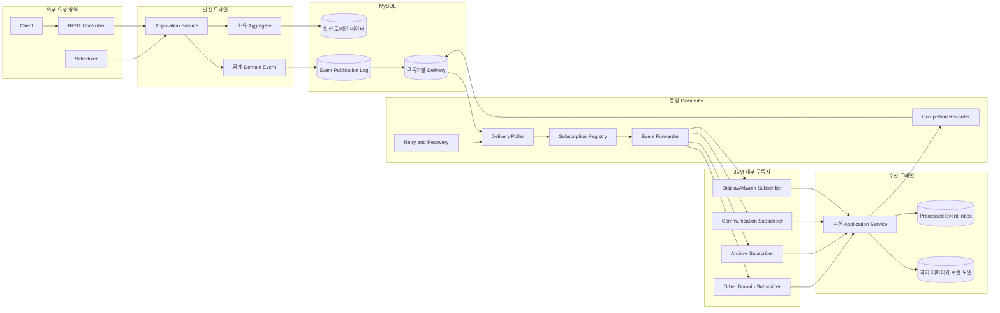
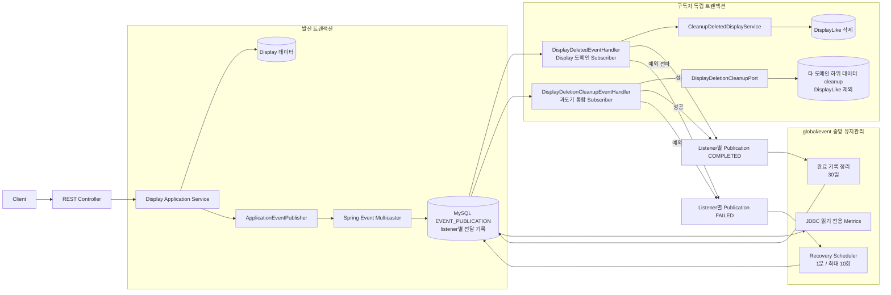
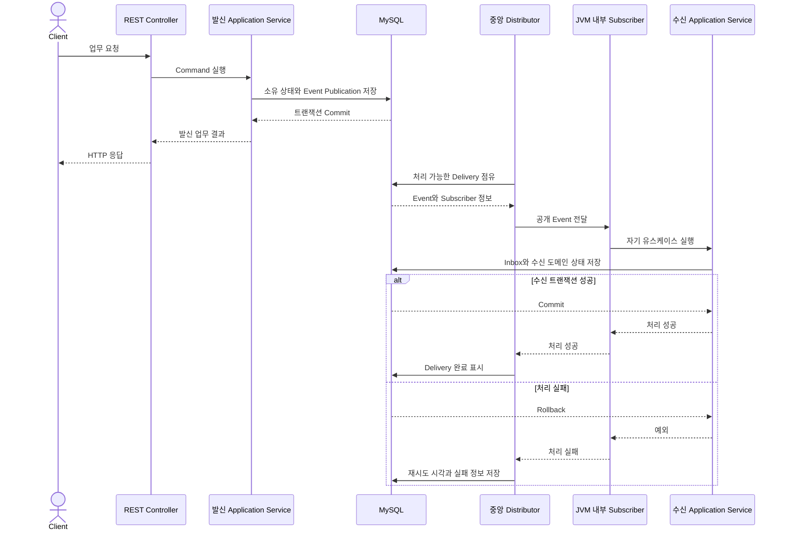
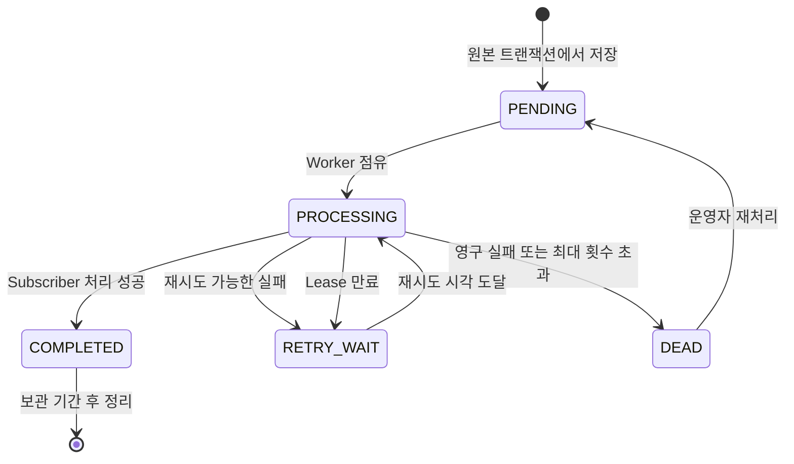

# 비동기 Domain Event 기반 도메인 간 의존 전환 계획

> 상태: 1차 구현 기준 확정. 중앙 전달 기반과 `DisplayDeleted` 첫 적용을 완료했다.
> 조사 기준: 2026-09-17 프로젝트 소스, `AGENTS.md`, `docs/project_architecture_guide.md`.
> 결정 기준일: 2026-09-19.

## 1. 목적과 범위

목표는 비동기 처리 추가가 아니라, 각 도메인이 다른 도메인의 내부 구현과 원본 테이블에 직접 의존하지 않도록 변경하는 것이다.

- 각 도메인은 자기 데이터와 비즈니스 규칙만 변경한다.
- 도메인 간 후속 상태 변경은 영속 이벤트 발행·구독으로 연결한다.
- 수신자는 공개 계약을 받아 자기 Application Service를 실행한다.
- 다른 도메인의 정보는 이벤트로 유지하는 수신 도메인의 로컬 참조·조회 모델에서 읽는다.
- 도메인 간 Entity 객체 연관은 식별자 참조로 변경한다.
- 중앙 distributor는 전달·재시도·복구를 담당하고 업무 규칙과 공동 업무의 판단을 담당하지 않는다.

이번 범위에서 제외한다.

- 전체 Entity를 Domain Model/JpaEntity로 분리하는 전면 리팩터링.
- 브로커, 별도 서비스, Saga 프레임워크의 선제 도입.
- 회원 탈퇴를 이유로 기존에 없던 전체 콘텐츠 삭제 기능 추가.
- 무관한 Controller, 응답, 예외 처리, Mapper 구조 정리.

이 문서의 표현은 다음 기준으로 구분한다.

| 표현 | 의미 |
|---|---|
| 확인 | 현재 소스에서 확인한 사실 |
| 제안 | 구현 시 적용할 후보 구조와 작업 순서 |
| 결정 필요 | 기술·업무 정책에 대한 개발자 확정이 필요한 항목 |

운영 DB의 실제 스키마·데이터, 실행 중 장애 동작, 실제 서버 수는 확인하지 않았다. 소스 조사 결과와 운영 환경의 일치 여부는 구현 전 확인한다.

### 1.1 2026-09-19 확정 결정

| ID | 확정 내용 |
|---|---|
| D1 | Spring Boot 4.0.7과 맞춘 **Spring Modulith 2.0.7 JDBC Event Publication Registry**를 사용한다. |
| D2 | 학교 인증·검증된 대학 정보는 User, 프로필·작가 자격은 Artist가 소유한다. `User.isVerified`는 이행 기간 호환 투영으로 둔다. |
| D3 | 대학 정보 변경은 User 공개 Command가 검증·변경하고 `UniversityChanged`를 발행한다. |
| D4 | 일반 후속 처리는 최종 정합성으로 처리한다. 탈퇴, 권한 회수, 숨김·삭제, 공개→비공개 전환에는 강한 검증을 적용한다. |
| D5 | 일반 API는 발신 도메인 상태와 Event Publication이 커밋된 뒤 기존 성공 응답을 반환한다. 첫 구현에서 202 응답이나 완료 조회 API는 추가하지 않는다. |
| D6 | 민감 경로에 한해 소유 도메인의 공개 Query 계약을 JVM 내부에서 동기 호출할 수 있다. 내부 Service·Repository·Entity 참조와 localhost REST 호출은 금지한다. |

강한 검증은 다음 경로에 적용한다.

- 인증 요청 시 회원 활성 상태.
- 전시 삭제·숨김·공개 상태가 영향을 주는 조회와 쓰기.
- 전시 멤버 탈퇴·역할 회수 이후 작품 수정 권한.
- Q&A 담당 권한과 비공개 질문 접근.
- 개인 질문의 공개→비공개 전환이 통합 조회에 반영되기 전 접근.

일반 프로필·닉네임·북마크 표시와 권한 부여에는 이벤트 반영 지연을 허용한다. 강한 검증용 공개 Query는 소유 도메인이 안정된 요청·응답 계약으로 제공하며, 호출자는 소유 도메인의 내부 구현을 참조하지 않는다.

## 2. 현재 구조와 의존 현황

### 2.1 프로젝트 기준

**확인**

- 도메인별 `presentation/application/domain/infrastructure` 구조와 Command/Query/UseCase/Result가 부분 적용되어 있다.
- 실제 Aggregate는 상당수가 JPA Entity 자체다.
- `build.gradle`: Java 21, Spring Boot 4.0.7, JPA/JDBC, Querydsl 5.1.0, MySQL, Flyway, Caffeine, Actuator/Prometheus.
- 조사 시점에는 Spring Modulith 및 이벤트 브로커 의존성이 없었다.
- 아키텍처 문서 §8.5는 `AbstractAggregateRoot/registerEvent()`를 기준으로 설명한다.
- 조사 시점의 실제 이벤트 처리는 전시 삭제의 `ApplicationEventPublisher` 방식이며 `registerEvent()` 사용은 확인되지 않았다.

아키텍처 문서의 이벤트 시점 설명은 구현 PR에서 정정해야 한다. Spring Data의 Repository 이벤트 발행과 리스너의 AFTER_COMMIT 실행은 별개다. Dirty checking이나 bulk UPDATE만으로 이벤트가 자동 발행된다고 가정하지 않는다.

### 2.2 Java 의존 목록

아래 화살표는 현재 코드에서 참조하는 도메인 → 참조되는 도메인이다. 제안 이벤트의 방향과 다를 수 있다. 파일은 `src/main/java/com/example/demo/domain/` 아래에 있다.

| 참조 방향 | 주요 관련 파일 | 현재 동작과 결합 이유 |
|---|---|---|
| archive → display | `SaveArchiveDisplayService`, `GetArchivedDisplaysService`, `ArchiveDisplayResult` | Summary UseCase로 저장 대상 확인·목록 조합, 외부 Result 사용 |
| archive → displayartwork | `SaveArchiveWorkService`, `GetArchivedWorksService`, `GetArchivedArtistsService`, `ArchiveWorkResult`, `ArchiveArtistResult` | 작품 요약·작가별 작품/전시 통계 조회 |
| archive → personalartwork | `SaveArchivePersonalWorkService`, `GetArchivedWorksService`, `ArchiveWorkResult` | 개인 작품 존재·요약 조회 |
| archive → artist | `SaveArchiveArtistService`, `GetArchivedArtistsService`, `ArchiveArtistResult`, `ArchiveArtistResponse` | artistUserId를 profileId로 변환, 프로필·활동 분야 조회, 외부 Result/Enum 참조 |
| archive → memo | `DeleteArchiveDisplayService`, `DeleteArchiveWorkService`, `DeleteArchivePersonalWorkService`, `GetArchivedDisplaysService`, `GetArchivedWorksService` | Memo Repository/Entity로 직접 삭제·내용 조회 |
| memo → archive | 각 `Upsert*MemoService`, `Delete*MemoService`, `MemoPermissionChecker` | Archive Entity/Repository로 존재·소유자 검증 |
| artist → user | `CreateArtistProfileService`, `UpdateArtistProfileService`, `ArtistPermissionChecker` | User 읽기, 작가 인증·대학명 직접 변경, 외부 Exception/VO/Validator 사용 |
| artist → user | `ArtistProfile`, `ArtistProfileRepository`, `ArtistProfileJpaRepository`, `JpaArtistProfileRepositoryAdapter`, `ArtistProfileMapper` | User 객체 연관·조회 인자·매핑 |
| display → user/artist | `CreateDisplayService` | User Repository로 회원 조회, ArtistPermissionChecker로 인증 확인 |
| display → user | `InviteDisplayMemberService`, `GetDisplayMembersService`, `GetMyDisplayInvitationsService`, `UpdateMyDisplayNicknameService`, `DisplayMemberResult`, `MyDisplayInvitationListResult` | 초대 대상 검증·회원 정보 조합, User Entity 인자 |
| display → archive | `DisplayBookmarkEnrichmentService` | 북마크 여부 보강 |
| display → displayartwork | `JpaDisplayContentPublicationAdapter`, `JpaArtworkCreatorRenameAdapter` | 작품 공개 Repository·Enum 사용, Creator 이름 변경 |
| displayartwork → display | `CreateDisplayArtworkService`, `ReorderDisplayArtworksService`, `DisplayArtworkQueryService`, `AuthorSetupService`, `DisplayArtworkPermissionChecker`, `DisplayArtwork` | 전시 존재·권한·멤버·정책·상태 검증, 객체 연관 |
| displayartwork → archive | `DisplayArtworkQueryService` | 작품 저장 여부 조회 |
| personalartwork → artist/archive | `PersonalArtworkQueryService`, `GetPersonalArtworkSummariesService` | 작가명·저장 여부 조회 |
| artworkcommunication → displayartwork | `ArtworkFeelingValidator`, `ArtworkQuestionValidator`, `GetArtworkFeelingsService` | 작품 Summary UseCase로 존재·정보 확인 |
| displaycommunication → display | `DisplayReviewValidator`, `CreateDisplayReviewReplyService`, `GetDisplayReviewRepliesService`, `GetMyDisplayReviewsService` | ReviewAccess/Summary UseCase·Result·ErrorCode로 공개·기간·참여자 확인 |
| personalartworkcommunication → personalartwork | `PersonalArtworkFeelingValidator`, `PersonalArtworkQuestionValidator`, `PersonalArtworkCommunicationPermissionChecker` | Access UseCase/Result로 작품 존재·소유자 확인 |
| lounge → user | `LoungePermissionChecker` | 인증 작가 카테고리 접근 검증 |

Service를 기존 UseCase 인터페이스로 바꾸는 것만으로 목표를 충족하지 않는다. 외부 Result/Enum/Exception도 내부 결합 제거 대상이다.

### 2.3 숨은 DB·SQL·Querydsl 의존

| 참조 방향 | 주요 파일 | 확인한 내용 |
|---|---|---|
| displayartwork → user | `UserVerificationJpaEntity`, `UserVerificationJpaRepository`, `JpaArtistVerificationRepositoryAdapter`, `JpaUserNicknameRepositoryAdapter` | 실제 User 테이블 매핑, 인증·닉네임 조회 |
| personalartwork → user | `PersonalArtworkUserVerificationJpaEntity`, 관련 Repository/Adapter | 실제 User 테이블 인증 플래그 조회 |
| artworkcommunication → user/displayartwork | `UserReferenceJpaEntity`, `UserExistenceJpaAdapter`, `CreatorReferenceJpaEntity`, Creator 조회 구현 | 실제 User/Creator 테이블로 존재·표시·접근·답변 권한 확인 |
| personalartworkcommunication → user | `PersonalArtworkUserReferenceJpaEntity`, `PersonalArtworkUserExistenceJpaAdapter` | 실제 User 테이블 조회 |
| displaycommunication → user | `DisplayReviewUserReferenceJpaEntity`, `DisplayReviewUserExistenceJpaAdapter` | User 테이블 조회, 탈퇴 제외 조건 |
| lounge → user | `JdbcLoungeWriterRepositoryAdapter` | JDBC로 User 닉네임·이미지 조회 |
| archive → display | `SpringDataArchiveDisplayJpaRepository` | JPQL JOIN Display, 원본 공개/삭제 상태로 목록·북마크 필터 |
| artist → user | `JpaArtistProfileSummaryQueryRepositoryAdapter` | Querydsl의 artistProfile.user.id 경로 |
| displayartwork → display | `SpringDataDisplayArtworkJpaRepository`, `JpaArtworkSummaryQueryRepositoryAdapter`, `JpaArtistWorkStatsQueryRepositoryAdapter` | artwork.display 상태·학교·유형·정책 탐색과 공개 UPDATE |
| artworkcommunication → 여러 도메인 | `JpaMyArtworkFeelingQueryRepositoryAdapter`, `JpaMyArtworkQuestionQueryRepositoryAdapter`, `JpaReceivedArtworkQuestionQueryRepositoryAdapter` | 전시/개인 작품 소통 UNION, 작품·Creator·User JOIN |
| display → 여러 도메인 | `JpaDisplayDeletionCleanupAdapter` | 작품·소통·아카이브·메모 직접 JPQL 변경 |

현재 참조 Entity는 다른 도메인의 원본 테이블을 재매핑한 것이며 이벤트 기반 로컬 모델이 아니다. 새 로컬 모델은 수신자 소유 테이블을 사용한다.

사용자 존재 검증도 동일하지 않다. displaycommunication은 `deletedAt IS NULL`을 확인하지만 두 작품 소통 도메인의 존재 검증은 기본 existsById다. 작품 인증 참조 모델은 탈퇴 여부를 포함하지 않는다. 이를 모두 active=true로 바꾸면 동작 변경이므로 별도 승인 대상이다.

### 2.4 트랜잭션·JPA 연관·운영 경로

**확인한 공동 트랜잭션**

- 작가 생성: ArtistProfile/활동 분야 저장 + User.completeArtistVerification().
- 작가 수정: ArtistProfile/활동 분야 수정 + User.changeUnivName().
- 전시 공개: Display/DisplayContent + DisplayArtwork 공개.
- 예약 공개: DisplayContent + DisplayArtwork 공개.
- 전시 닉네임 수정: TeamMember + Creator 이름 변경.
- 아카이브 취소: Archive + Memo 삭제.
- 전시 삭제 cleanup: 원본 삭제와 분리된 REQUIRES_NEW에서 여러 도메인을 함께 정리.

**확인한 외부 객체 연관**: ArtistProfile → User, DisplayArtwork → Display. 동일 도메인의 이미지·필드·멤버 연관은 이번 범위에서 유지한다.

Flyway에는 개인 작품 소통 → PersonalArtwork/User, 전시 리뷰 → Display/User 등의 외부 FK가 있다. 객체 연관 제거와 FK 제거는 분리한다. 실제 FK와 CASCADE는 초기 스키마 및 운영 information_schema를 함께 확인한다.

**조사 당시 전시 삭제 이벤트**

- DeleteDisplayService가 DisplayDeletedEvent(displayId, deletedAt)를 발행한다.
- DisplayDeletionCleanupEventHandler는 AFTER_COMMIT + Async로 즉시 최대 3회 실행한다.
- JpaDisplayDeletionCleanupAdapter는 여러 도메인을 직접 정리한다.
- 최종 실패만 별도 테이블에 기록한다. 구독자별 완료·지연 재시도·자동 복구는 없다.
- 커밋 이후 프로세스 종료나 큐 유실은 복구할 발행 기록이 없다.
- 삭제 사실·시각·조건부 정리 SQL·기존 테스트·실패 기록은 재사용한다.
- 일부 좋아요 soft delete SQL은 hard delete 마이그레이션 및 현재 Repository 정책과 대조한다.

**Scheduler/캐시/인증**

- DisplayContentPublicationScheduler는 서울 시간 자정 실행이며 포트 뒤에서 작품까지 변경한다.
- DisplayListCacheEvictor는 커밋 후 Caffeine 캐시를 지우고 프로세스 내부 AtomicLong 버전을 증가시킨다. 다른 서버 캐시는 갱신하지 않는다.
- WithdrawUserService는 User 탈퇴와 RefreshToken 삭제만 수행한다.
- User.withdraw()는 deletedAt/닉네임을 바꾸며 isVerified를 false로 바꾸지 않는다.
- JwtAuthenticationFilter에서 회원 활성 상태를 조회하지 않는다. 탈퇴 즉시 기존 AccessToken 차단을 보장한다고 전제하지 않는다.
- TokenProvider/JwtFactory의 User 인증 모델 의존과 CacheConfig의 도메인 캐시명 의존은 공통 기술 경계 문제다. 이벤트 subscriber로 억지 변환하지 않는다.

## 3. 목표 구조와 책임 분리

### 3.1 처리 흐름

```text
HTTP / Scheduler / Command
  → 소유 도메인 Application Service
  → 자기 Aggregate 검증·변경
  → 내부 사건을 공개 계약으로 변환
  → 상태 변경 + 이벤트/전달 기록을 동일 트랜잭션에 저장
  → COMMIT
  → 중앙 전달 기반이 구독자별 작업 실행
  → 수신 도메인 Application Service
  → 자기 상태/로컬 모델 + Inbox + 후속 이벤트를 동일 트랜잭션에 저장
  → 전달 완료 표시
```

전달은 at-least-once를 전제로 한다. 구독자가 업무 커밋 후 완료 표시 전에 종료되면 재전달되며 수신자 멱등성으로 처리한다.

#### 전체 구조도

아래 구조가 이 문서에서 기본으로 삼는 구현 방식이다. REST API는 외부 요청의 진입점으로만 사용하고, 도메인 간 이벤트 전달은 MySQL 발행 기록과 JVM 내부 Subscriber 호출로 처리한다. `domain_event_outbox`와 `event_delivery`는 직접 Outbox를 구현할 때의 논리적 이름이며, Spring Modulith를 선택하면 Event Publication Registry 테이블과 API가 같은 책임을 맡는다.



발신 도메인 데이터 변경과 Event Publication Log 저장은 같은 DB 트랜잭션에 참여한다. 구독자별 Delivery는 Event가 누구에게 전달되어야 하는지를 나타내며, distributor가 업무 대상이나 규칙을 판단한다는 의미가 아니다. 구독자 등록 정보에 따라 기술적으로 fan-out할 뿐이다.

구독자가 자기 데이터를 변경할 때 Processed Event Inbox도 같은 트랜잭션에 저장한다. 따라서 수신 커밋 직후 서버가 종료되어 같은 Event가 다시 전달되더라도 업무 변경을 중복 적용하지 않는다.

### 3.2 내부 사건과 공개 계약

제안 패키지 구조다. 기존 전체 패키지를 이동하지 않고 적용 기능부터 추가한다.

```text
domain/<owner>/
  domain/event/                  내부 Aggregate 사건
  contract/event/v1/             다른 도메인에 공개하는 불변 계약
  application/event/             내부 사건 → 공개 계약 매핑·기록
  application/port/              EventPublicationPort 등 전달 기술 포트

domain/<receiver>/
  application/event/             공개 계약 수신 adapter
  application/command/           자기 상태를 변경하는 유스케이스
  application/query/             자기 조회 모델 Repository/DTO
  domain/reference/              규칙 판단에 필요한 로컬 참조 모델
  infrastructure/persistence/    참조·조회 모델, Inbox 저장 구현
```

도메인 내부 사건과 공개 이벤트가 같은 데이터라도 목적은 다르다. 공개 계약에는 Entity·기존 Result·내부 Exception을 넣지 않는다. 필요한 계약 Enum은 contract에 정의하고 수신자의 내부 Enum으로 매핑한다.

공통 Envelope 제안: eventId, eventType, schemaVersion, producer, aggregateType/id/version, occurredAt(UTC), correlationId, causationId(필요 시), payload.

- schemaVersion: 계약 직렬화 버전.
- aggregateVersion: 같은 객체의 상태 순서.
- eventType/subscriberId: Java 클래스명·메서드명 이동과 독립된 안정적인 논리 식별자.
- 이벤트 payload: 실제 소비에 필요한 최소 필드. 전체 Aggregate 복제 금지.

### 3.3 Event, Command, Query

| 목적 | 표현 |
|---|---|
| 이미 수락된 초대의 결과 | DisplayMemberAccepted Event |
| 대학명을 변경해 달라는 요청 | User 소유 공개 Command |
| 지금 작품 등록이 가능한지 판단 | 검증/승인 요청 또는 준비 업무. 과거형 Event로 위장하지 않음 |
| 작가명·회원 이미지 조회 | 수신 도메인 로컬 모델 Query |
| 여러 도메인의 준비가 필요한 공개 | 업무 상태를 보관하는 조정자 + 준비 Command + 결과 Event |

중앙 distributor가 `if DisplayDeleted then 작품·메모 삭제` 같은 업무 분기를 갖지 않는다. 어떤 사실에 어떻게 반응하는지는 각 수신 도메인이 결정한다.

## 4. 중앙 distributor 구현 계획

### 4.1 중앙에서 구현할 것과 구현하지 않을 것

| 중앙 전달 기반 책임 | 도메인 책임 |
|---|---|
| 이벤트 직렬화·저장·대상 구독자 식별 | 내부 사실 정의·공개 계약 매핑 |
| 작업 점유·비동기 실행·완료 기록 | 업무 규칙·권한·소유자 판정 |
| backoff·최대 시도·격리·재처리 | 조건부 상태 변경·업무 멱등성 |
| 서버 장애·lease 회수·다중 worker 경합 | 로컬 참조/조회 모델·tombstone |
| 계약 reader/upcaster 등록 기반 | 계약 의미 변경·변환 규칙 |
| 처리 지연·미처리·실패 관측 | 공동 업무 준비·완료·보상 판단 |
| 완료 전달 기록 정리 | 삭제 대상·예약 공개 대상 판단 |

분배기는 구독 handler를 등록받아 호출하되 수신 도메인의 Repository/Entity를 참조하지 않는다. 중앙에 전체 업무 의존 그래프를 하드코딩하지 않는다.

### 4.2 기술 선택: Modulith 또는 직접 DB Outbox

| 항목 | Spring Modulith JDBC 발행 레지스트리 | 직접 구현 DB Outbox |
|---|---|---|
| 기존 Spring 이벤트 활용 | 용이 | 기록 포트·worker 도입 |
| 원본 트랜잭션의 전달 기록 | transactional listener별 제공 | 직접 event/delivery INSERT |
| 완료·실패·재발행 기반 | 제공, 운영 정책은 추가 | 모두 직접 구현 |
| 다중 서버·업무 순서·멱등성 | 버전별 동작 검증과 업무 구현 필요 | claim/lease/Inbox/순서 구현 필요 |
| 논리 계약·리스너 호환 관리 | 저장된 타입·리스너 ID 이행 검토 | eventType/subscriberId 직접 관리 |
| 신규 의존성 | 필요 | 기존 JDBC/MySQL로 가능 |
| 유지보수 부담 | 상대적으로 낮음 | 높음 |

**구현 기준**: Spring Boot 4.0.7과 Spring Modulith 2.0.7 JDBC Event Publication Registry를 사용한다. 직접 DB Outbox는 비교 후보로만 유지하며 1차 구현에는 넣지 않는다. Kafka, Redis, RabbitMQ 같은 브로커도 1차 구현의 필수 조건이 아니다.

Modulith를 선택하면 기존 레지스트리와 별개인 일반 Outbox worker를 중복 구현하지 않는다. 중앙 distributor는 기존 레지스트리의 실행 기반과 프로젝트의 재시도·관측·운영 정책으로 구성한다. 도메인의 Inbox·업무 멱등성·버전 적용은 별도로 필요하다.

#### 확정된 1차 중앙 Distributor 구조

`Spring Event Multicaster`, JDBC `Event Publication Registry`, 복구 Scheduler가 논리적 중앙 distributor를 구성한다. 별도 커스텀 `EventForwarder`나 Outbox Poller는 만들지 않는다. `@ApplicationModuleListener`는 커밋 이후 별도 트랜잭션에서 수신 유스케이스를 실행하고, 성공과 실패는 listener별 publication 상태로 기록한다.



첫 도메인별 기준 구현으로 Display Subscriber를 분리했다. `DisplayDeletedEventHandler`는 공개 계약을 받아 `CleanupDeletedDisplayService`를 호출하고 Display 소유 `DisplayLike`만 삭제한다. 삭제 쿼리는 같은 이벤트가 다시 전달되어도 결과가 같으므로 별도 Inbox를 두지 않는다. 다른 도메인을 정리하는 과도기 통합 Subscriber와 publication 완료 상태도 서로 독립적이다. 비멱등 subscriber가 처음 도입되는 책임 분리 PR에서 수신 도메인 소유 Inbox를 추가한다.

1차 구현 파일과 운영 기준은 다음과 같다.

- `build.gradle`: Modulith BOM/Starter JDBC 2.0.7, 전체 테스트 JVM heap 2 GiB.
- `V20260919000100__create_event_publication.sql`: Modulith 2.0.7 공식 MySQL v2 `EVENT_PUBLICATION` 스키마.
- `global/event`: 1분 주기 복구, 최대 완료 시도 10회, 동시 재처리 4개, 30일 완료 기록 정리, Registry 지표와 payload 없는 로그.
- `display/contract/event/v1/DisplayDeletedEvent`: `eventId`, `displayId`, `deletedAt` 공개 계약.
- `DisplayDeletedEventHandler`와 `CleanupDeletedDisplayService`: Display 도메인의 기준 Subscriber. DisplayLike Repository만 사용하며 수신·커밋 완료·실패 로그를 eventId와 함께 남긴다.
- `DisplayDeletionCleanupEventHandler`: 아직 분리되지 않은 타 도메인 cleanup을 담당하는 과도기 Subscriber. DisplayLike SQL은 제거했으며 예외를 삼키지 않고 Registry에 전달한다.
- `V20260919000200__add_display_cleanup_failure_recovery.sql` 및 legacy recovery runner: 미처리 기존 실패 행을 결정적 eventId로 재발행하고 같은 트랜잭션에서 `recoveredAt`을 기록한다.

검증할 항목: Spring Boot/Jackson 호환, Flyway schema, listener별 완료, stale 작업 회수, 2서버 재발행 경합, 업무 커밋/완료 표시 사이 장애, 저장된 타입/리스너 rename, payload 크기.

공식 근거:

- [Spring Modulith 이벤트·레지스트리·독립 트랜잭션](https://docs.spring.io/spring-modulith/reference/events.html)
- [호환성·DB 스키마·완료 모드·다중 서버 재시작 설정](https://docs.spring.io/spring-modulith/reference/appendix.html)
- [Spring Data Aggregate 이벤트 발행](https://docs.spring.io/spring-data/commons/reference/repositories/core-domain-events.html)

### 4.3 직접 Outbox를 선택할 경우의 주요 파일

다음은 후보 이름이며 최소 요구에 맞춰 구현한다. 모든 역할을 독립 인터페이스로 추상화할 필요는 없다.

```text
global/event/
  contract/EventEnvelope
  application/EventPublicationPort
  application/EventSubscriber
  application/EventSubscriptionRegistry
  application/EventDistributor
  application/EventRetryPolicy
  application/EventReprocessingService
  infrastructure/persistence/JdbcEventPublicationAdapter
  infrastructure/persistence/JdbcEventDeliveryRepository
  infrastructure/serialization/EventContractReaderRegistry
  infrastructure/scheduling/EventDeliveryPoller
  infrastructure/scheduling/EventRecoveryScheduler
  infrastructure/observability/EventDeliveryMetrics
```

- EventPublicationPort: 호출자의 트랜잭션에 참여해 event/delivery 저장. 독립 트랜잭션으로 먼저 커밋하지 않는다.
- EventSubscriber: 안정적인 subscriberId, 지원 계약, handler를 등록한다. 등록 실패·중복 ID는 기동 시 검출한다.
- SubscriptionRegistry: 기술 라우팅만 수행한다. 초기 이행 전에 구독 등록과 이벤트 보존을 먼저 배포한다.
- EventDistributor: claim → handler 호출 → 성공/실패 표시. 업무를 직접 수행하지 않는다.
- Poller: DB를 진실의 원천으로 조회한다. 커밋 후 wake-up은 지연 최적화일 뿐 전달 보장은 아니다.
- RecoveryScheduler: lease 만료·정체 작업 회수. 새 시도에도 기존 eventId를 유지한다.
- ReprocessingService: 실패·중단 작업을 동일 ID로 재실행. 외부 운영 API 추가 여부는 별도 결정한다.

### 4.4 저장 모델과 트랜잭션

| 저장 모델 | 최소 역할·필드 |
|---|---|
| domain_event_outbox | Envelope, payload, createdAt. 사실은 불변 |
| event_delivery | eventId/subscriberId unique, 상태, attemptCount, nextAttemptAt, leaseUntil, claimToken, completedAt, 오류 요약 |
| 수신 도메인의 processed_event | eventId/subscriberId unique, processedAt. 업무와 함께 커밋 |
| projection_checkpoint | projection 이름·generation·적재/재생 진행 상태. 필요한 도메인에만 |
| 공동 업무 operation | 준비·완료·실패 상태와 관련 ID/버전. 필요한 업무에만 |

직접 구현 상태 예: PENDING → PROCESSING → COMPLETED, 실패 시 RETRY_WAIT 또는 DEAD. lease 만료는 재점유 후보가 된다.

#### 이벤트 한 건의 처리 시퀀스



HTTP 응답 시점은 발신 도메인의 트랜잭션 완료 시점이다. 구독 도메인의 처리가 끝난 시점까지 기다리는 구조가 아니다. 여러 도메인의 완료가 API 성공 의미에 포함되어야 하는 기능은 일반 Event 처리와 구분해 §6의 operation/완료 장벽을 적용한다.

1. 원본 상태 변경과 event/delivery를 한 트랜잭션으로 커밋한다.
2. worker는 짧은 점유 트랜잭션으로 작업을 확보한다.
3. 수신 서비스는 자기 트랜잭션에서 Inbox 중복 검사, 업무 변경, 후속 이벤트 저장을 수행한다.
4. worker는 수신 업무 커밋 성공 이후에만 완료를 표시한다.
5. 수신 커밋 후 worker 장애 시 재전달한다. Inbox로 중복 처리를 막는다.

AFTER_COMMIT에서 최초 Outbox INSERT를 수행하지 않는다. 이벤트 기록 실패 시 원본 변경도 롤백한다. 장시간 handler 실행 동안 claim용 DB 잠금을 유지하지 않는다.

다중 서버는 claimToken으로 이전 worker의 늦은 완료 기록을 막는다. lease 만료만으로 중복 업무가 사라지지 않으므로 Inbox와 조건부 변경이 필요하다. 운영 MySQL 버전에서 SKIP LOCKED 지원 여부를 확인한 뒤 점유 SQL을 확정한다.

#### Delivery 상태 흐름



Modulith를 선택하면 실제 상태명과 전환은 선택한 버전의 Event Publication Lifecycle을 따른다. 위 상태도는 프로젝트가 보장해야 하는 논리적 수명 주기를 나타낸다.

### 4.5 순서, 멱등성, 재시도, 계약 호환

- latest-state 투영은 저장된 aggregateVersion보다 큰 경우에만 적용한다.
- 순서가 필요한 업무는 aggregate별 순차 처리 또는 gap 대기·복구를 설계한다.
- 서로 다른 aggregate 버전을 비교하지 않는다.
- Member/Creator 자식 변경에 부모 @Version이 자동 증가한다고 가정하지 않는다. 독립 버전 또는 명시적인 부모 버전 증가를 정한다.
- 삭제 tombstone으로 오래된 Created/Updated가 상태를 부활시키지 못하게 한다.
- 이벤트를 통계의 count++로 바로 적용하지 않는다. 기여 상태 또는 Inbox로 중복을 방어한다.
- 제안 초기 재시도: exponential backoff + jitter, 총 10회 시도, 최대 간격 30분. 수치는 운영 요구에 따라 확정한다.
- 계약 오류·역직렬화 실패·영구 업무 실패는 격리한다. 업무상 이미 완료된 상태는 성공으로 처리할 수 있다.
- handler가 예외를 삼켜 정상 반환하면 전달 성공으로 오인할 수 있다. 기존 cleanup의 자체 retry/failure-record 경로는 영속 기반과 중복하지 않게 조정한다.
- 구버전 계약 reader/upcaster를 유지한다. 의미 변경은 v2 계약으로 분리한다.
- 리스너 이동·삭제 전 저장된 subscriberId/타입과 미완료 작업을 이행한다.

### 4.6 관측·보관·캐시

- 로그: eventId, subscriberId, aggregateId/version, correlationId, attempt, 처리 결과.
- 지표: pending/failed 수, oldestPendingAge, 전달 지연, 처리 시간, retry rate, projection gap.
- 민감한 payload를 전체 로그로 출력하지 않는다.
- 구독자별 완료·실패·다음 실행 시각으로 미처리 작업을 추적한다.
- 모든 수신자 완료 및 재구축 요구를 확인한 후 batch 정리한다.
- 제안 보관: 완료 전달 30일, 실패 90일. Inbox·원본 이벤트·tombstone의 기간은 함께 결정한다.
- Modulith의 리스너별 발행 기록을 무제한 replay 이력으로 간주하지 않는다. 재구축용 snapshot/이력 보존 방식을 별도로 정한다.

Caffeine 캐시 무효화는 일반 subscriber 작업 1회 완료와 다르다. 서버 A의 cache.clear는 서버 B에 적용되지 않는다. 제안은 DB cache revision + 각 서버의 revision 확인이다. 기존 프로세스 내부 버전 키 패턴은 유지할 수 있다. 확인 주기에 따른 지연을 명시하며 엄격한 숨김·삭제 조회는 이 방식만으로 보장하지 않는다.

## 5. 도메인별 구현 계획

모든 새 이벤트·모델·서비스 이름은 제안이다. 발행 시점은 자기 상태 확정과 같은 트랜잭션이며 실제 수신 실행은 커밋 이후다. 기존 파일명은 §2, 신규 패키지 역할은 §3을 기준으로 한다.

### 5.1 display

**최종 소유**: 전시 상태·기간·정책, 멤버/초대/전시 닉네임, DisplayContent, 전시 좋아요.

- DeleteDisplayService: DisplayDeleted를 영속 발행. 자기 좋아요만 정리한다.
- Publish/Hide/Update/Reservation 경로: 상태·정책·기간 변경 계약 기록.
- Accept/Exit/멤버 변경 경로: 멤버 사실과 버전 기록. 초대 수락 자체는 전시 내부 트랜잭션으로 유지한다.
- UpdateMyDisplayNicknameService: Creator 직접 rename 제거, DisplayMemberNicknameChanged 발행.
- CreateDisplayService/InviteDisplayMemberService: User/Artist 내부 의존을 로컬 자격 모델 또는 확정된 승인 정책으로 교체한다.
- GetDisplayMembers/GetMyDisplayInvitations/Result: User Entity 인자를 자체 UserReference/DTO로 교체한다.
- DisplayBookmarkEnrichmentService: 로컬 BookmarkReference 사용.
- JpaDisplayContentPublicationAdapter: DisplayContent 기능 유지, 외부 작품 공개 메서드 제거.
- JpaArtworkCreatorRenameAdapter와 multi-domain cleanup은 후속 책임 이전 후 제거한다.

| 발행 계약 | 최소 payload | 수신자 |
|---|---|---|
| DisplayDeleted | displayId, deletedAt | displayartwork, displaycommunication, archive |
| DisplayCreated/Updated | displayId, 응답에 필요한 제목·이미지·기간·조직·유형 등 | archive, displayartwork 및 실제 조회 소비자 |
| DisplayPublished/Hidden/PublicationPolicyChanged | displayId, 공개 상태, artworkOpenPolicy, startDate 및 필요한 변경 기간 | displayartwork, displaycommunication, archive |
| DisplayMemberAccepted/Exited/RoleChanged | displayId, memberId, userId, role, active/accepted | displayartwork, displaycommunication |
| DisplayMemberNicknameChanged | displayId, memberId, userId, displayNickname | displayartwork |

로컬 모델: UserReference, ArtistQualificationReference, BookmarkReference. 외부 FK 변경은 별도 PR이다.

**영향**: 공개·닉네임의 즉시 작품 반영이 최종 정합성으로 바뀐다. 숨김·삭제 보장 범위와 전시 생성 자격 검증 방법을 확정해야 한다.

### 5.2 displayartwork

**최종 소유**: 작품·이미지·필드·작성자·Q&A 담당자, 작품 좋아요, 작품 개수/정렬 규칙.

- DisplayArtwork.display를 displayId로 교체한다.
- Create/Reorder/AuthorSetup/PermissionChecker/QueryService에서 Display/TeamMember/DisplayRepository 의존 제거.
- 작품 Repository/Query Adapter의 artwork.display 탐색을 DisplayReference JOIN 또는 자기 모델 조건으로 변경한다.
- UserVerificationJpaEntity의 원본 User 매핑을 실제 User/ArtistQualification 로컬 테이블로 교체한다.
- DisplayDeleted 수신 시 자기 작품/좋아요를 정리하고 작품별 DisplayArtworkDeleted를 발행한다.
- 공개 Event 수신 및 자체 예약 작업에서 자기 작품만 공개한다.
- Creator 변경 경로는 안정적인 Creator 식별자·Q&A 권한을 포함한 ArtworkCreatorsChanged를 기록한다.
- 닉네임 반영은 전시 멤버에서 유래한 이름에만 적용하도록 기존 previousName 조건/이름 출처 정책을 확정한다.

로컬 모델: DisplayReference, DisplayPublicationReference, DisplayMemberReference, UserProfile, ArtistQualificationReference, BookmarkReference. 필요 필드가 겹치는 전시 모델은 한 테이블에 합칠 수 있으며 불필요한 모델 분리는 피한다.

발행: DisplayArtworkCreated/Updated/Deleted, ArtworkCreatorsChanged. payload는 artworkId/displayId, 작품명·썸네일·공개 상태·관련 작가/Q&A ID 등 실제 조회·권한 소비 필드다.

수신 유스케이스: DeleteArtworksForDeletedDisplay, ApplyDisplayReference, ApplyDisplayMemberReference, ApplyDisplayPublication, PublishDueArtworks, RenameCreatorsForDisplayMember.

**영향**: 초대 수락 직후 등록, 권한 회수 직후 수정, 공개/숨김 직후 조회의 의미가 달라진다. 현재 최대 50개·정렬·대리 등록·QA_ONLY 규칙은 자기 규칙으로 보존한다.

### 5.3 user

**최종 소유 추천**: 회원 활성·계정 프로필, 학교 이메일 인증·검증된 대학 정보.

- 가입/프로필·닉네임 변경/학교 인증/탈퇴 성공 경로에 공개 계약 기록을 추가한다.
- VerifySchoolEmailVerificationService의 noRollbackFor 경로를 고려해 인증 성공 사실만 기록한다. 실패 시도 저장과 성공 Event를 혼동하지 않는다.
- WithdrawUserService는 기존 User/RefreshToken 변경을 유지하고 UserWithdrawn을 기록한다.
- Artist 자격 소유권 선택에 따라 User.isVerified를 로컬 투영으로 전환하거나 공동 인증 업무를 구현한다.
- Artist의 대학 변경 요청을 받는 공개 Command/결과 Event가 필요하면 이 도메인에서 검증한다.

발행: UserRegistered, UserProfileChanged, SchoolEmailVerified, UniversityChanged, UserWithdrawn.

최소 데이터: userId, 필요한 닉네임·이미지·활성 상태·탈퇴 시각. 학교 계약은 필요한 구독자에게만 검증 결과·학교 식별 정보를 전달한다. 학교 이메일 원문을 모든 도메인에 전파하지 않는다.

**영향**: 탈퇴 즉시 AccessToken 차단 여부는 별도 정책이다. 다른 콘텐츠 전체 삭제를 새로 추가하지 않는다.

### 5.4 artist

**최종 소유 추천**: 작가명·프로필·활동 분야·프로필 완성/작가 자격. 학교 인증은 user 소유다.

- ArtistProfile.user를 userId로 변경한다.
- Repository.findByUser(User), Mapper(User 인자), Summary Query의 user.id 탐색을 제거한다.
- CreateArtistProfileService의 User.completeArtistVerification 직접 호출을 제거한다.
- UpdateArtistProfileService의 User.changeUnivName 직접 호출을 제거한다.
- 학교 자격은 UserEligibilityReference를 사용한다. 대학 변경 검증이 필요하면 User Command를 통해 승인 후 반영한다.
- User의 ProfileImageUrl/Exception/SchoolEmailValidator는 계약 값·자체 검증·공개 요청으로 대체한다.

발행: ArtistProfileCreated/Updated, ArtistQualificationChanged. 수신자: user(호환 투영 필요 시), display, 작품 도메인, lounge, archive 등 실제 소비자.

최소 데이터: profileId/userId, qualificationState, 작가명·이미지·활동 분야·소개·링크·대학 중 기존 응답에 필요한 필드.

**결정 필요**: 기존 User.isVerified 의미, 프로필 생성 응답 시 자격 완료 보장, 대학명 권위. User 인증이 권위로 남으면 인증 완료를 별도 공동 업무로 추적해야 한다.

### 5.5 personalartwork

- PersonalArtworkArtistVerificationJpaAdapter의 원본 User 조회를 로컬 자격 조회로 변경한다.
- PersonalArtworkQueryService/GetPersonalArtworkSummariesService의 ArtistProfile Repository/UseCase/Result 의존 제거.
- 작가명은 ArtistSummary, 저장 여부는 BookmarkReference에서 읽는다.
- 생성·수정·삭제에 PersonalArtworkCreated/Updated/Deleted를 기록한다.

최소 데이터: personalArtworkId, ownerUserId, 작품명·썸네일 등 소비 필드, deletedAt. 접근 모델에는 소유자·활성 상태가 필요하다.

구독: ArtistProfile/Qualification 변경, 필요한 User 상태 변경, ArchiveSaved/Removed.

수신자: personalartworkcommunication, archive, 통합 조회를 담당하는 artworkcommunication.

**영향**: 생성 직후 저장·질문·감상 요청의 존재 모델 반영 지연, 작가명/북마크 표시 지연.

### 5.6 archive

- 각 SaveArchive*Service는 자기 TargetReference/Summary로 대상 확인·profileId 변환을 수행한다.
- 각 DeleteArchive*Service에서 MemoRepository/Memo Entity 의존 제거.
- ArchiveSaved/ArchiveRemoved를 기록하고 Memo 삭제는 memo 수신 유스케이스로 이전한다.
- GetArchivedDisplays/Works/Artists는 자기 Summary/MemoPreview/Stats 모델을 사용한다.
- SpringDataArchiveDisplayJpaRepository의 원본 Display JOIN 제거.
- 외부 Result/ActivityCategory Enum을 자체 조회 DTO/계약 매핑으로 변경한다.

로컬 모델: DisplaySummary, DisplayArtworkSummary, PersonalArtworkSummary, ArtistSummary, MemoPreview, ArtistWorkMembership/Stats.

구독: 대상 Created/Updated/Deleted·공개 상태, ArtistProfile, ArtworkCreators, Memo 변경.

발행 최소 데이터: archiveKind/archiveId/ownerUserId/targetId/active, savedAt 또는 removedAt.

통계는 작품별 작가 연결·공개 여부·displayId 기여를 저장하고 멱등 집계한다. 매 이벤트마다 count++하지 않는다.

**보존**: signedId 통합 작품 커서, savedAt/ID 동률 정렬, artistUserId 요청 의미, 대상 필터와 hasNext 계산.

### 5.7 memo

- 각 Upsert/Delete*MemoService와 MemoPermissionChecker의 외부 Archive Entity/Repository 제거.
- ArchiveSaved/Removed로 자기 ArchiveReference를 유지한다.
- 소유자·활성 상태는 자기 참조 모델로 판단한다.
- ArchiveRemoved를 받으면 자기 메모만 삭제한다.
- MemoCreated/Updated/Deleted로 archive 목록용 Preview를 갱신한다.

payload: memoId, archiveKind/archiveId, 기존 목록에 필요한 content/visitDate, 삭제 상태.

**경합**: ArchiveRemoved 반영과 Memo upsert는 같은 참조 행 잠금 또는 버전 조건으로 직렬화한다. 이벤트 도착 이전의 stale active 문제는 이 잠금으로 해결되지 않는다. 재저장은 새로운 archiveId를 사용하고 오래된 제거 이벤트가 새 메모를 지우지 않게 한다.

### 5.8 displaycommunication

- DisplayReviewValidator/Reply 생성·조회에서 외부 ReviewAccess/Result/ErrorCode 의존 제거.
- DisplayReviewAccessReference에 대표자·수락 멤버·공개 상태·시작/종료일·삭제 상태 유지.
- 원본 User 매핑을 자체 UserProfile로 교체하되 현재 탈퇴 제외 의미 보존.
- DisplayDeleted 수신 시 자기 리뷰·답변·좋아요 등 하위 데이터를 정리한다.
- GetMyDisplayReviewsService의 Summary 조회를 로컬 DisplaySummary로 변경한다.

구독: Display 상태·기간·멤버·삭제·Summary, UserProfile/Withdrawn.

**영향**: 공개/개최일·답변 참여자 판단 지연. 서울 날짜 기준과 숨김 후 작성 가능 여부를 명시한다.

### 5.9 artworkcommunication

- 작품 Summary UseCase를 ArtworkReference로 대체한다.
- UserReferenceJpaEntity/CreatorReferenceJpaEntity의 외부 테이블 매핑을 자체 UserProfile/CreatorAccessReference로 변경한다.
- DisplayArtworkDeleted 수신 시 자기 질문·감상·답변·좋아요를 정리한다.
- 개인 작품 소통 이벤트를 자기 통합 조회 테이블에 투영한다.
- My/Received Query Adapter의 외부 테이블 UNION/JOIN을 자체 투영 조회로 교체한다.

구독: 작품/Creator 변경, User 변경, 개인 작품/질문/감상/답변 상태 변경.

로컬 모델: ArtworkReference, CreatorAccessReference, UserProfile, PersonalCommunicationFeed.

**보존**: createdAt/sourceOrder/itemId 커서, answered 상태, isPublic, 수신 질문의 Q&A 담당 조건.

**엄격 검증 대상**: 비공개 질문 열람과 Q&A 권한 회수. 최신 로컬 버전은 아직 도착하지 않은 회수를 증명하지 못한다.

### 5.10 personalartworkcommunication

- Access UseCase/Result를 PersonalArtworkReference로 대체한다.
- User 원본 참조를 UserProfile로 교체한다. 기존 존재/탈퇴 의미는 결정 후 변경한다.
- PersonalArtworkDeleted 수신 시 자기 질문·감상과 하위 데이터만 정리한다.
- 질문·감상 생성/수정/삭제, 답변 상태, 질문 공개 범위 변경을 기록해 통합 조회를 갱신한다.

발행: PersonalArtworkQuestion/Feeling Created/Updated/Deleted, 답변 상태 및 공개 범위 변경 계약. 실제 소비 필드가 겹치면 변경 Event 하나로 묶을 수 있다.

최소 데이터: source itemId, personalArtworkId, 작성자 ID, content, createdAt, answerStatus/isPublic 등 기존 통합 응답 필드.

**영향**: 통합 목록 반영 지연, 삭제·소유자 판단 지연. 공개 범위 변경 누락으로 비공개 질문이 노출되지 않도록 검증한다.

### 5.11 lounge 및 공통 영역

- LoungePermissionChecker의 UserRepository를 로컬 ArtistQualification/User 상태 조회로 교체한다.
- JdbcLoungeWriterRepositoryAdapter의 User SELECT를 자기 WriterProfile 조회로 교체한다.
- UserProfile/Withdrawn, ArtistQualification 변경을 구독한다.
- 글/댓글의 기존 작성자 규칙은 자기 도메인에서 유지한다.

공통 보안은 ID·공통 인증 계약으로 필요한 부분만 정리한다. Health/Jackson 같은 무관한 의존은 변경하지 않는다.

## 6. 즉시 정합성과 공동 업무 결정

로컬 모델의 버전·TTL·최근 처리 시각은 발신 도메인에 더 최신 상태가 없다는 증명이 아니다. 비동기 전환으로 기존 모든 의미를 보존한다고 가정하지 않는다.

| 기능 | 충돌 | 선택지 | 추천/확정 필요 |
|---|---|---|---|
| 인증·초대 수락 직후 등록 | 자격 부여 Event 반영 전 거절 | 재시도, 반영 대기, 승인 Command | 안전한 거절·재시도 우선. 기존 즉시 UX 필수면 완료 대기/승인 |
| 탈퇴·멤버 나가기 | 회수 Event 전 stale 권한 허용 | 지연 수용, 차단 절차, 제한적 동기 승인 | 민감 경로는 차단 또는 승인 |
| 삭제·숨김 후 조회 | 로컬 모델·다른 서버 캐시 stale 노출 | 지연 수용, 수신 차단 완료 장벽 | 보장 범위를 먼저 확정 |
| 전시 공개 | Display 공개와 작품 공개가 분리 | 부분 공개, 준비 후 완료 | 종전 완료 의미 필요하면 operation 추적 |
| 대학명 변경 | 검증 전 변경 사실 발행 불가 | User Command 승인, 소유권 정책 변경 | User가 검증한 결과 Event 사용 |
| 아카이브 취소 ↔ 메모 생성 | stale active로 새 메모 생성 | 후속 정리, 취소 완료 장벽, 승인 | 지연 허용 여부 확정 |
| 북마크·메모 표시 | 변경 직후 조회가 이전 값 | 지연 수용, 대상 버전 반영 대기 | 기본 지연 수용, 필요 UX만 읽기 장벽 |

엄격한 최신성이 필요할 때의 후보:

1. 공개 동기 검증/승인 계약을 제한적으로 허용한다. 내부 구현 결합은 제거하지만 이벤트 계약만 참조한다는 엄격 목표에는 예외가 남는다.
2. 공개 Command → 승인/거절 Event로 대기 상태 업무를 구현한다. 조정자는 operation 상태를 보관하고 API 완료 의미를 조정한다.
3. 삭제·회수·숨김을 준비/차단 상태로 시작하고 필요한 수신자의 차단 완료를 확인한 뒤 확정한다.
4. 허용 지연을 명시하고 사후 정리를 수용한다.

검증 응답을 기다리는 것만으로 원자성이 생기지 않는다. 검증 후 권한 회수 경합을 막으려면 예약·펜싱·차단 같은 업무 프로토콜이 필요하다. 조정자는 중앙 distributor가 아니라 업무 소유 도메인의 Application에 둔다. 모든 기능에 공동 업무 상태를 추가하지 않는다.

## 7. 단계별 구현 및 PR 분할

각 PR은 아래 완료 기준을 통과한 뒤 다음 단계로 진행한다. DB는 추가부터 배포하고 제거는 안정화 후 수행한다.

### 단계 0 / PR 0: 기준과 결정 확정

- 목표: 의존 목록·기존 API/트랜잭션 의미·업무 보장 수준 고정.
- 파일: 이 계획 및 아키텍처 문서 §8.5 보완. Application 변경 없음.
- DB/이벤트: 없음. 계약 목록과 소유권 결정.
- 테스트: 기존 삭제/권한/공개/커서 테스트를 회귀 목록으로 선정.
- 완료: 전달 기술, 인증/대학 소유권, 권한 회수/숨김 보장, API 대기 의미 결정.

### 단계 1 / PR 1: 영속 전달 기반

- 선행: 기술 선택. Modulith 호환 PoC 또는 직접 worker 설계.
- 파일: §4 중앙 기반, 선택 시 build.gradle/config, Flyway.
- DB: 발행/구독자별 전달 기록, 테스트용 Inbox. 실제 업무 Event 적용 없음.
- 이벤트: 검증용 계약/구독자로만 전달 보장 확인.
- 테스트: rollback, commit 직후 kill, 수신 커밋 후 kill, 중복, 2서버, lease, 구버전 JSON.
- 완료: DB를 통해 작업 복구, 실패가 완료로 표시되지 않음, 지연·실패 추적 가능.
- API 영향: 없음. backoff/보관/운영 재처리 방식 확정.

### 단계 2 / PR 2: 기존 전시 삭제 영속화

- 선행: 전달 기반 안정화.
- 파일: DeleteDisplayService, DisplayDeleted 공개 계약, 기존 handler/failure recorder.
- DB: 이벤트 기록 및 기존 실패 데이터의 새 작업 변환 준비.
- 이벤트: DisplayDeleted → 기존 cleanup. 아직 업무 책임 분리 단계는 아니다.
- 테스트: 삭제 rollback, listener 실행 전 종료, 기존 cleanup 실패, 재실행 중복.
- 완료: 커밋된 전시 삭제가 항상 복구 가능한 기록을 남김.
- 영향: 기존 응답 유지. handler의 자체 retry/예외 삼킴을 조정해 중앙 완료 판정과 일치시킴.

### 단계 3 / PR 3a~3b: 삭제 책임 분리

- 선행: 작품 displayId로 자기 데이터 접근 경로 확보, 삭제 정합성 정책 확정.
- 파일: 작품/리뷰/archive/memo의 자기 삭제 유스케이스와 subscriber. 기존 cleanup 외부 JPQL 제거.
- DB: tombstone/reference, Inbox, 대량 처리 필요 시 durable batch 진행 상태.
- 이벤트: DisplayDeleted → 작품/리뷰/archive; DisplayArtworkDeleted → 소통/archive; ArchiveRemoved → memo.
- 테스트: 구독자별 실패, 정리 중 재기동, 작품 생성/저장/메모 upsert 경합, 재저장.
- 완료: display가 다른 도메인 데이터를 수정하지 않고 기존 삭제 대상 대조 통과.
- 영향: 구독자별 부분 완료·최종 정합성. 삭제 완료 장벽 필요 여부 확정.

작품 ID 목록을 DisplayDeleted에 넣지 않는다. 작품 도메인이 자기 displayId로 조회하고 삭제 후 자기 Event를 발행한다. 이미 삭제된 작품을 제외한 조회만 재처리의 근거로 삼지 않는다. 배치 등록 후 listener가 완료되면 배치의 별도 완료·실패 추적을 이어간다.

### 단계 4 / PR 4a~4b: 회원·작가 참조와 소유권

- 선행: User 프로필 모든 쓰기 경로 조사, 인증/대학 소유권 결정.
- 파일: User 변경 서비스의 발행, 각 User/Writer 참조, Artist 생성·수정·permission/mapper.
- DB: UserProfile/UserEligibility/ArtistQualification, 필요 시 operation.
- 이벤트: UserRegistered/ProfileChanged/Withdrawn, SchoolEmailVerified, ArtistProfile/QualificationChanged, UniversityChanged.
- 테스트: 초기 적재, 탈퇴 표기, 인증 성공/실패, 생성 직후 등록, 탈퇴↔인증, 대학 검증 실패.
- 완료: 표시 조회 전환 후 자격 검증 전환. 직접 User 상태 변경 제거.
- 영향: MyUser.isVerified 및 등록 자격의 반영 지연·응답 의미 문서화.

### 단계 5 / PR 5a~5b: 전시 멤버 참조와 외부 객체 연관 제거

- 선행: 멤버/자식 변경의 버전 증가 보장, 로컬 모델 shadow 대조.
- 파일: Display/Member 계약, 작품/리뷰 permission·AuthorSetup·Query, ArtistProfile.user/DisplayArtwork.display 및 Repository/Mapper.
- DB: Display/MemberReference, userId/displayId 인덱스. 기존 컬럼 활용 가능성을 확인.
- 이벤트: DisplayCreated/Updated 및 멤버 Accepted/Exited/Role/Nickname.
- 테스트: 수락→등록, 나가기→수정, 삭제↔수락, 닉네임 역전, 외부 객체 탐색 없이 응답 대조.
- 완료: 외부 Entity 객체 연관·권한 인자·Repository 호출 제거.
- 영향: FK 제거는 후반 독립 PR. 엄격 권한 예외를 임시/최종으로 구분.

### 단계 6 / PR 6: 공개·예약 처리 이전

- 선행: 전시 공개 모델과 버전 안정화, 공개 완료 의미 확정.
- 파일: publication port/adapter의 작품 메서드 제거, 작품 자체 공개 유스케이스/Scheduler, 필요 시 operation 조정자.
- DB: publication reference, 예약 작업 unique key 또는 조건부 상태 갱신, 필요 시 operation.
- 이벤트: Published/Hidden/PolicyChanged, 필요 시 준비 완료 결과.
- 테스트: 자정, 정책/시작일 변경, 삭제/숨김↔예약, 2서버 중복, 재기동 catch-up.
- 완료: 각 도메인의 Scheduler가 자기 데이터만 변경, stale 공개가 숨김/삭제를 복구하지 않음.
- 영향: Display와 작품의 원자적 공개 의미 변경 또는 준비 완료 프로토콜 적용.

### 단계 7 / PR 7a~7b: 조회 의존 제거

- 선행: Summary/Archive/Memo/Creator 이벤트와 초기 적재.
- 파일: Archive 조회/저장 서비스·Result, Memo permission, Bookmark 보강, PersonalArtwork 작가 조회, Stats/Query Adapter.
- DB: Summary, MemoPreview, BookmarkReference, 작품별 통계 기여 모델.
- 이벤트: 각 Summary 변경, ArchiveSaved/Removed, Memo 변경, Artist/Creator 변경.
- 테스트: signed cursor, hasNext, 통계 중복/삭제/QA_ONLY, 메모 수정·저장 직후 조회.
- 완료: 외부 Summary/Stats UseCase/Result·Repository·원본 Display JOIN 제거.
- 영향: 표시 지연과 읽기 장벽 정책, Event 필드 최소화 확정.

### 단계 8 / PR 8: 소통 검증·통합 조회 전환

- 선행: 비공개 질문/권한 회수 정책과 접근 모델 완료.
- 파일: 각 Validator/PermissionChecker, 외부 User/Creator 참조 구현, My/Received Native Query.
- DB: AccessReference, CreatorAccess, PersonalCommunicationFeed.
- 이벤트: 작품/Creator/개인 작품/소통 변경 및 공개 범위 변경.
- 테스트: 비공개 열람·Q&A 회수·답변 상태·삭제·공개 전환·통합 커서.
- 완료: 외부 테이블 매핑/UNION/JOIN과 Access UseCase 제거.
- 영향: 엄격 동기 예외의 제거 또는 승인 목록 확정.

### 단계 9 / PR 9: 잔여 의존·운영 정리

- 선행: 전체 대조·복구·운영 관측 안정화.
- 파일: legacy port/adapter/ref Entity 제거, 경계 검사, cache revision, 운영 정리.
- DB: 실제 FK 대조 후 외부 FK 제거 여부 결정, 기록 정리 migration/작업.
- 이벤트: 기존 계약 유지. 구독자 rename/remove 이행 확인.
- 테스트: 전체 회귀, 정적 경계 검사, 2서버 캐시, 기록 정리 후 재전달·복구.
- 완료: 임시 경로 제거, 승인된 예외만 잔존, 미완료/실패 작업 운영 절차 확립.

## 8. 데이터 이행·전환·되돌리기

### 8.1 초기 적재와 누락 방지

1. 원본 이벤트 기록을 먼저 배포한다. bulk/Scheduler/dirty checking 경로 누락을 확인한다.
2. 새 projection generation은 production 응답에 사용하지 않는다.
3. 원본 데이터와 버전을 일관된 snapshot으로 추출한다.
4. 수신 도메인 테이블에 초기 적재한다.
5. snapshot 전후 기록된 Event를 재생한다. Event 보관·구독 등록이 적재 전에 준비되어야 한다.
6. 버전 조건으로 오래된 적재/재생이 최신 상태를 덮지 못하게 한다.
7. 누락 ID·버전 gap·tombstone을 대조하고 catch-up 완료를 확인한다.
8. shadow 조회 → 로컬 조회 → 로컬 검증 순서로 전환한다.

MAX(outbox.id)만 경계로 사용하면 작은 ID를 가진 트랜잭션의 늦은 커밋을 놓칠 수 있다. 짧은 쓰기 차단으로 경계를 확보하거나 일관된 snapshot + 중첩 재생 + 버전 대조를 적용한다. 무중단 필수 여부·데이터 규모를 확인하고 방법을 결정한다.

이행 SQL의 외부 원본 조회는 한시적 운영 작업이며 런타임 Repository에 남기지 않는다. 초기 적재에는 탈퇴/삭제 상태도 포함해 stale 생성이 부활하지 못하게 한다.

### 8.2 대조와 플래그

- 플래그는 이벤트 기록/구독 실행/로컬 조회/로컬 검증으로 분리한다.
- Shadow subscriber는 별도 투영만 변경하고 production 삭제를 실행하지 않는다.
- 기존과 신규 쓰기 병행이 필요하면 조건부 처리·시각 보존·후속 Event 중복 방어를 먼저 구현한다.
- 대조는 총 건수뿐 아니라 ID별 상태·실제 응답·커서·권한 판단을 비교한다.
- 읽기 모델을 전환한 뒤 권한/존재 모델을 전환한다.

대조 대상: 공개/삭제 필터, accepted/deleted 멤버, User 존재/활성 차이, 작가명·대학·활동 분야, Creator/QA_ONLY, 통계, signedId, sourceOrder, hasNext, 메모 재저장, 비공개 노출.

### 8.3 되돌리기

- 이벤트 기록은 유지해 재전환 가능성을 보존한다.
- 기존 경로가 호환되는 기간에는 조회/검증 플래그로 되돌린다.
- 신규 worker를 중단해도 pending/failed 작업은 삭제하지 않는다.
- 이미 처리한 업무를 자동 역변경하지 않는다.
- 테이블/컬럼 추가와 legacy 제거를 다른 배포로 나눈다.
- 인증 소유권·operation 상태처럼 의미가 바뀐 기능은 단순 rollback이 불가능하다. 구버전 호환 기간 또는 forward recovery를 설계한다.
- 기존 cleanup 실패 기록과 삭제됐으나 정리되지 않은 전시는 이행 작업으로 durable delivery를 생성한다.

## 9. 검증 계획과 완료 기준

### 9.1 기존 테스트 활용

현재 테스트 중 DisplayDeletionCleanupEventHandlerTest, WithdrawUserServiceTest, DisplayContentPublicationServiceTest, DisplayArtworkPermissionCheckerTest 및 Archive/Memo/Query Adapter 테스트를 회귀 기준으로 활용한다.

PR별 변경 도메인 테스트와 compile/spotless를 수행한다. 전달·잠금·MySQL SQL·2서버 복구는 H2만으로 완료하지 않고 실제 MySQL 통합 환경에서 검증한다. 문서 작성 단계에서는 실행하지 않았다.

### 9.2 필수 경합·장애 시나리오

| 시나리오 | 통과 기준 |
|---|---|
| 원본 rollback/Outbox 실패 | 상태와 전달 기록 원자성 |
| commit 직후·수신 호출 전 서버 종료 | durable 작업 복구 |
| 수신 커밋 후 완료 기록 전 종료 | 재전달 후 업무 결과 동일 |
| 하나의 subscriber 실패 | 다른 완료는 유지, 실패만 재처리 |
| 중복·동시 전달·lease 만료 | Inbox와 claimToken으로 오처리 방지 |
| Event 역전·버전 gap | 최신 투영 보존, 필요한 순차 업무 대기·복구 |
| 전시 삭제 ↔ 작품/리뷰/저장 생성 | 결정된 허용 지연 준수, 최종 잔여·부활 없음 |
| 숨김 ↔ 공개/예약 실행 | stale 작업이 최신 숨김·삭제를 되돌리지 않음 |
| 시작일/정책 변경 ↔ 자정 | 최신 버전 적용·누락 작업 catch-up |
| 초대 수락 ↔ 삭제/중복 수락/등록 | 전시 내부 원자성 유지·부여 지연 처리 일관 |
| 멤버 나가기 ↔ 작품 수정 | 결정된 권한 회수 보장 |
| 탈퇴 ↔ 인증/초대/작품·질문 생성 | 진행 중 요청과 이후 요청 정책 준수 |
| Q&A 회수 ↔ 비공개 조회/답변 | 승인되지 않은 정보 노출 방지 |
| 닉네임 A→B→C 역전 | 최종 C, 직접 입력 이름 보존 |
| Archive 취소 ↔ Memo upsert/재저장 | stale 제거가 새 archiveId의 메모를 지우지 않음 |
| 질문 공개→비공개 ↔ 통합 조회 | 공개 범위 Event 누락·stale 노출 방어 |
| 캐시 적재 ↔ 무효화·서버 A/B | 이전 namespace 재사용·다른 서버 stale 추적 |
| snapshot 적재 ↔ 변경/삭제 | 누락·덮어쓰기·부활 없음 |
| 계약/리스너 rename·완료 정리 | 저장된 작업 재실행·중복 방어 유지 |

### 9.3 경계 검사

- 다른 도메인의 Service/UseCase/Repository/Entity/Result/Enum/Exception import 탐지.
- 외부 원본 테이블 @Table 매핑 탐지.
- JPQL 외부 Entity·완전 한정 Enum, SQL 외부 JOIN/UPDATE/DELETE, Querydsl 외부 탐색 검토.
- Scheduler/cache adapter/공통 보안의 승인 예외 목록 유지.
- 이행 SQL과 runtime SQL 분리.

단순 문자열 검사만으로 경계를 증명하지 않는다. Query Adapter/Repository 리뷰와 실행 테스트를 병행한다. 이를 위해 새 검사 라이브러리를 반드시 추가할 필요는 없다.

### 9.4 최종 완료 체크리스트

- [ ] 각 도메인은 자기 데이터만 변경한다.
- [ ] 원본 상태와 이벤트 전달 기록은 같은 트랜잭션에 저장된다.
- [ ] subscriber별 완료·실패·재시도·재처리가 가능하다.
- [ ] 장애·중복·순서 역전·다중 서버의 복구가 검증된다.
- [ ] 외부 내부 Service/Repository/Entity/Result 및 원본 테이블 조회가 제거된다.
- [ ] ArtistProfile.user와 DisplayArtwork.display가 식별자로 바뀐다.
- [ ] 로컬 모델의 초기 적재·지속 동기화·대조가 완료된다.
- [ ] 기존 API/커서/오류와 변경된 트랜잭션 의미가 문서화된다.
- [ ] 권한·탈퇴·숨김·삭제의 즉시 보장/허용 지연이 확정된다.
- [ ] 비공개 질문·공개 범위·예약·캐시 경합 검증이 통과한다.
- [ ] legacy 정리와 승인된 임시/최종 예외 구분이 완료된다.
- [ ] 미처리·지연·실패 알림, 기록 보관·정리, 재구축 절차가 준비된다.

## 10. 후속 구현 전 결정 목록

| ID | 결정 | 기본 추천 |
|---|---|---|
| D1 | Modulith JDBC 또는 직접 Outbox, 호환 버전 | **확정: Modulith JDBC 2.0.7** |
| D2 | Artist 자격/User.isVerified 소유권 | **확정: 학교 User, 프로필 자격 Artist, User.isVerified 호환 투영** |
| D3 | 대학명 권위와 변경 요청 흐름 | **확정: User 공개 Command → UniversityChanged** |
| D4 | 권한·탈퇴·숨김·삭제 최신성 | **확정: 민감 경로 강한 검증, 일반 표시는 지연 허용** |
| D5 | 공개·인증 완료 API 의미 | **확정: 기존 성공 응답 유지, 202/완료 API 미도입** |
| D6 | 엄격 검증의 동기 공개 계약 예외 | **확정: 소유 도메인 공개 Query의 JVM 동기 호출 허용** |
| D7 | 초기 적재의 쓰기 차단/무중단 | 규모 측정 후 짧은 차단 또는 snapshot+재생 |
| D8 | 외부 FK 유지·제거와 물리 삭제 | 객체 연관 먼저, FK는 별도 PR |
| D9 | retry/lease/보관·운영 재처리 | §4 수치로 검증 후 조정 |
| D10 | 다중 서버 캐시 지연과 차단 | DB revision, 엄격 경로 별도 보장 |
| D11 | 탈퇴 사용자의 존재·표시·AccessToken 정책 | 현재 차이를 먼저 보존하고 변경은 승인 후 적용 |
| D12 | Creator 이름 갱신 범위 | 멤버 유래 이름과 직접 입력 이름 구분 |

D1~D6은 2026-09-19에 확정되었다. D7~D12는 각 후속 단계 착수 전에 실제 데이터 규모와 운영 정책을 근거로 확정한다.
